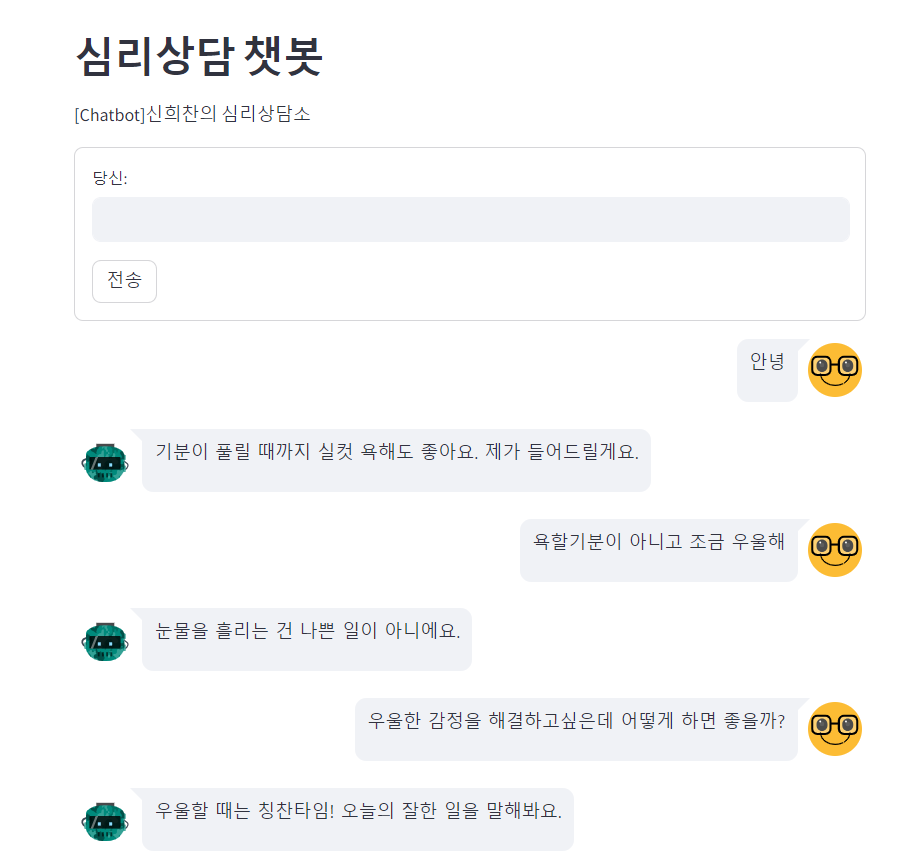

# Project_Chatbot
인공지능 챗봇 생성 및 데이터셋 누적 적용 모델을 소개합니다.

## pre-training model
SentenceBERT jhgan/ko-sroberta-multitask

## Dataset
웰니스 대화 스크립트 데이터셋

## Libraries used & Version

- pandas==2.1.1
- numpy==1.23.0
- streamlit==1.27.2
- streamlit-chat==0.1.1
- sentence-transformers==2.2.2
- scikit-learn==1.3.1

## Result

- streamlit 실행 과정에 libraries 버전 관리에 민감하게 반응하여 항상 업데이트 사항에 따른 버전 관리가 필요합니다.
- 단순 Chatbot 환경을 만드는 로직은 정형화되어 있으나 데이터셋을 답변 형태에 대한 예외처리 과정이 가장 중요할 것으로 판단됩니다.
